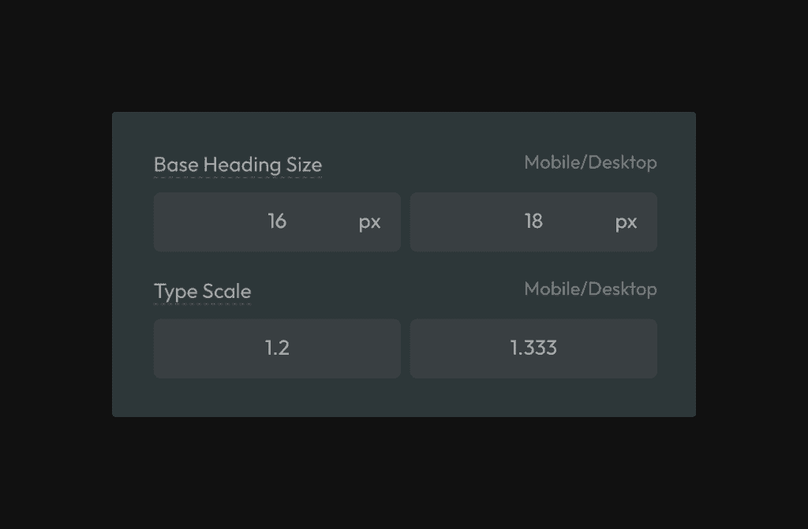

**All heading sizes are automatically responsive**, and unlike with other frameworks, **heading sizes in Automatic.css follow a perfect mathematical scale.**

## Fluid Heading Setup

To access settings for your headings, navigate to Typography > Headings in the dashboard.

To start, set a base font size for your headings.

The “base” font size serves two purposes:

1. It sets the default size of H4 headings on desktop.
2. It sets the starting point for the mathematical typography scale (for other sizes)

Typically, your base heading size should be slightly larger than your base text size. For example, if base text size is set to 18px, you can set your base heading size to 20px.

## Heading Type Scale

The second most crucial thing to customize within Automatic.css is the headings scale. The scale controls the degree of variance between heading sizes.

You can choose from popular typography scales (use the up/down arrows on your keyboard in the scale inputs) or set your scale manually.

It’s common to want to use a tighter scale on mobile devices than on desktop since mobile devices don’t have enough room to fit more extreme scales.

If you don’t want the scale to change between devices, make the Typography Scale and Mobile Typography Scale equal (double-check that the scale you’ve chosen works well on all devices).

**Note:** To generate a hierarchy, the scale values must be greater than 1.

## Fluid Heading Overrides

You can manually override heading sizes in Automatic.css. When you override a size, you’re effectively removing it from the mathematical scale. **No sizes above or below the size you’ve overridden will be affected.**

To override a heading size, click the heading level you’d like to target from within the tabs in the Typography > Headings area.

You’ll find the inputs to override that heading size toward the bottom of the list of inputs.

To override a size, input a value into the mobile or desktop field. You can override the max without overriding the min and vice versa. If an override value is not specified, ACSS will just use the default value.

## H5 & H6 Minimums

Because you have complete control over the type scale, creating a hierarchy where “S” and “XS” text sizes are too small and inaccessible for most users is possible.

As a protection, you can use the “min” fields in the text overrides for these sizes to set fixed minimums that “S” and “XS” will never go below. We do this for you by default out of the box, but you can adjust it if you’d like.

## How do I dial in the proper font sizes?

The primary values controlling font sizes in Automatic are the base and scale values.

The Base sizes allow you to adjust ALL SIZES EVENLY.

The Scales allow you to adjust the VARIANCE between sizes (larger scales create a larger variance, and smaller scales create more minor variance).

The final lever is to manually override any individual size.