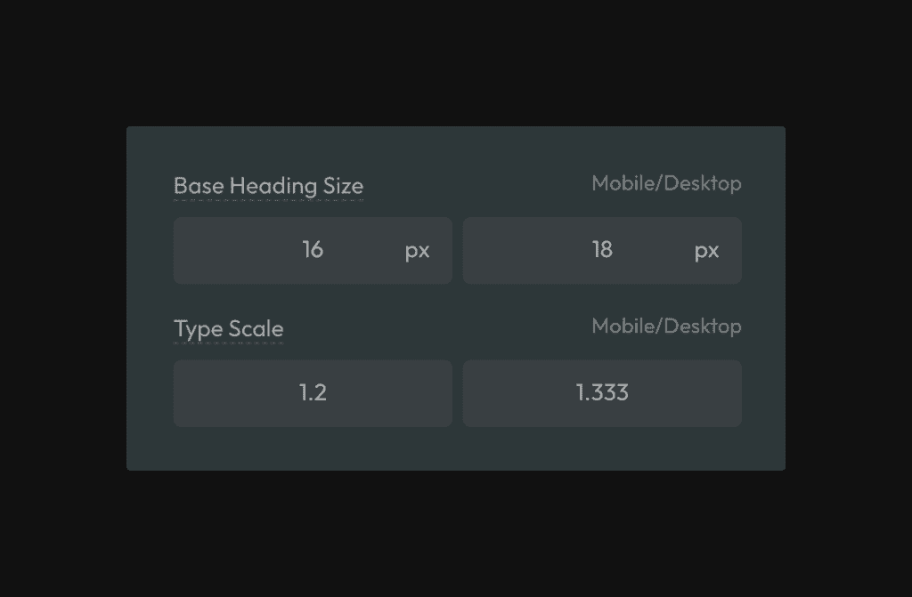

**All heading sizes are automatically responsive**, and unlike with other frameworks, **heading sizes in Automatic.css follow a perfect mathematical scale.**

## Fluid Heading Setup

To access settings for your headings, navigate to Typography > Headings in the dashboard.

- Read [about how-to guides](https://diataxis.fr/how-to-guides/) in the Diátaxis framework

To start, set a base font size for your headings.

The “base” font size serves two purposes: